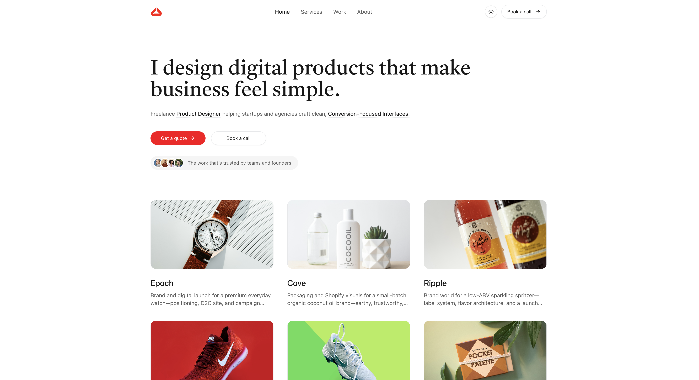

# Hatch NextJS Template

Hatch NextJS Template is a premium template built by https://www.shadcnblocks.com

- [Demo](https://hatch-nextjs-template.vercel.app/)
- [Documentation](https://docs.shadcnblocks.com/templates/getting-started)

## Screenshot



## Getting Started

```bash
npm install
```

```bash
npm run dev
```

Open [http://localhost:3000](http://localhost:3000) with your browser to see the result.

## Tech Stack

- Next.js 16 / App Router
- Tailwind 4
- shadcn/ui

## Deploy on Vercel

The easiest way to deploy your Next.js app is to use the [Vercel Platform](https://vercel.com)

## Static Export Support

This template is configured to support static export by default, making it easy to deploy on various platforms including Cloudflare Pages, GitHub Pages, and other static hosting providers.

To build for static export:

```bash
npm run build
# The output will be in the `out` directory when using `output: 'export'`
```

## Service detail pages (MDX)

Each service has its own MDX file under `src/content/services/`. Routes are generated at `/services/[slug]` (for example `/services/web-design-ux`). Copy an existing `.mdx` file, adjust frontmatter and body content, and add your slug to match the filename.
