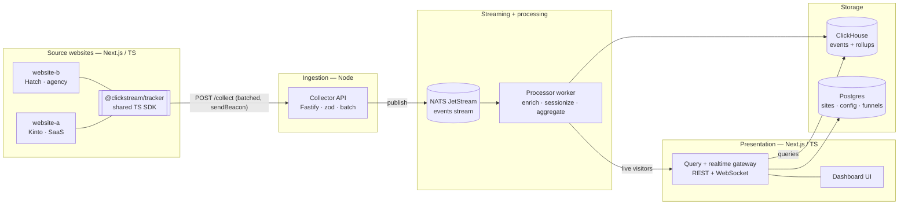
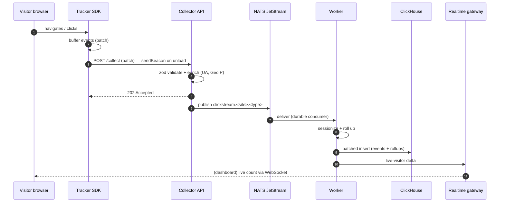

# Clickstream Analytics — Architecture

A self-built, end-to-end **clickstream analytics** pipeline in TypeScript/Node.js. Two real Next.js
websites emit behavioural events through a shared tracking SDK; a Node collector ingests them, a stream
carries them, a worker sessionizes and aggregates, ClickHouse stores them, and a Next.js dashboard
visualizes them — including live visitors in real time.

> **Why build it instead of using PostHog/GA?** The point of this project is to demonstrate
> TypeScript/Node back-end engineering — event ingestion, streaming, sessionization, columnar storage,
> and a real-time dashboard — not to configure a SaaS. Off-the-shelf tools are noted as the alternative,
> not the implementation.

---

## 1. Goals & non-goals

**Goals**
- Capture page views, clicks, scroll depth, and custom events from **two independent web properties**.
- One **reusable, typed tracking SDK** embedded in both sites (cross-property analytics).
- A horizontally-scalable **ingestion path** that never blocks or slows the websites.
- **Sessionization**, funnels, and retention computed from raw events.
- A **real-time dashboard** (top pages, referrers, funnels, live visitor count).
- Privacy-first: consent-gated, cookieless-capable, no PII by default.

**Non-goals (v1)**
- A/B testing, feature flags, server-side experimentation.
- Full GDPR tooling beyond consent gating + IP truncation.
- Multi-region / HA deployment (single-node Docker Compose is fine for the demo).

---

## 2. Source properties

| Site | Template | Type | Representative events |
|------|----------|------|------------------------|
| **website-a** | Kinto | SaaS / marketing + blog | pricing views, blog reads, sign-up CTA clicks, changelog visits |
| **website-b** | Hatch | Agency / portfolio | services views, work/case-study clicks, contact-form funnel |

Both are **Next.js (App Router) + TypeScript + Tailwind/shadcn**. Each is configured with a `site_id`
and loads the same tracker, so events from both flow into one pipeline and can be sliced per property.

---

## 3. High-level architecture



**Two paths**, deliberately decoupled:

- **Ingest (write) path** — SDK → Collector → JetStream → Worker → ClickHouse. Optimised for throughput
  and to be non-blocking for the websites.
- **Query (read) path** — Dashboard → Query gateway → ClickHouse/Postgres. Optimised for aggregation
  reads and real-time push.

---

## 4. Components

### 4.1 Tracking SDK — `@clickstream/tracker`
A small, dependency-light TypeScript package embedded in both sites.

- Auto-captures **page views** (App Router route changes), **clicks** (delegated, with
  `data-track` attributes), and **scroll depth**; exposes `track(name, props)` for custom events.
- Generates an **anonymous visitor id** and a **session id** (30-min inactivity window), stored in
  `localStorage` (or cookieless in-memory mode).
- **Batches** events and flushes on an interval, on `visibilitychange`, and via
  `navigator.sendBeacon` on unload — so tracking never delays navigation.
- **Consent-gated**: emits nothing until consent is granted; respects Do-Not-Track.
- Ships as an ESM package consumed by both Next.js apps (one `<AnalyticsProvider>` component).

### 4.2 Collector API (Node)
The public ingestion endpoint — the only internet-facing back-end service.

- **Fastify** (or NestJS) `POST /collect` accepting a batch of events.
- **Validates** every event with **zod** against the shared schema; rejects malformed batches.
- **Enriches** server-side: user-agent parsing (device/browser/OS), GeoIP (country/region) from a
  **truncated** IP, server receive timestamp.
- Applies **rate limiting** and a strict body-size cap; responds `202 Accepted` fast.
- **Publishes** each validated event to NATS JetStream (subject `clickstream.<site_id>.<type>`); on
  backpressure it can fall back to a local buffer. No DB writes on the hot path.

### 4.3 Event stream — NATS JetStream
- Durable, replayable event log between ingestion and processing (subject = routing key).
- Decouples the collector from ClickHouse: a storage hiccup never drops events or backs up the API.
- Reuses streaming expertise already shown elsewhere in the portfolio.

### 4.4 Processor worker (Node)
A JetStream consumer that turns raw events into stored, queryable data.

- **Sessionization** — groups events into sessions per `(visitor_id, site_id)` with a 30-min gap rule;
  derives session duration, entry/exit pages, bounce.
- **Aggregation/rollups** — maintains per-minute and per-day rollups (pageviews, uniques, top paths,
  referrers) for fast dashboard reads.
- **Funnels & retention** — evaluates configured funnels (e.g. *pricing → sign-up CTA → auth* on
  website-a; *services → work → contact* on website-b).
- **Batched inserts** into ClickHouse (async inserts / buffered) for write efficiency.
- Pushes **live-visitor** deltas to the realtime gateway.

### 4.5 Storage
- **ClickHouse** — primary store for raw events and rollup tables; columnar + `MergeTree` is the
  industry standard for clickstream (what PostHog/Plausible use under the hood). Handles billions of
  rows and fast `GROUP BY` aggregations.
- **Postgres** — small relational store for configuration: registered sites/API keys, funnel
  definitions, dashboard users. Not on the event hot path.

### 4.6 Query + realtime gateway (Node)
- **REST** endpoints for dashboard queries (timeseries, top pages, funnel conversion, retention),
  reading rollups from ClickHouse with short-TTL caching.
- **WebSocket** channel for the **live-visitors** widget and a real-time event feed.

### 4.7 Dashboard (Next.js + TS)
- Next.js App Router + React + shadcn/ui + Recharts (already in website-a's stack).
- Views: overview (visitors/pageviews timeseries), top pages & referrers, **per-site** filter,
  funnel conversion, sessions explorer, and a **live** panel over WebSocket.

---

## 5. Event model

A single typed envelope for every event, validated by zod at the edge and shared by SDK, collector,
and worker.

```ts
type EventType =
  | "page_view" | "click" | "scroll_depth"
  | "session_start" | "custom";

interface ClickstreamEvent {
  event_id: string;        // uuid, client-generated (idempotency)
  type: EventType;
  site_id: "website-a" | "website-b";
  ts: string;              // ISO 8601, client time
  visitor_id: string;      // anonymous, stable per browser
  session_id: string;      // rotates after 30-min inactivity
  url: string;             // path + query (PII stripped)
  referrer?: string;
  name?: string;           // for custom/click events
  props?: Record<string, string | number | boolean>;
  context: {
    user_agent: string;
    screen?: { w: number; h: number };
    locale?: string;
    consent: boolean;
  };
  // server-enriched (added by collector):
  server_ts?: string;
  ip_country?: string;
  device?: { browser: string; os: string; type: "mobile" | "desktop" | "tablet" };
}
```

`event_id` is an idempotency key (dedupe on replay), **never** a join key for analytics. `visitor_id`
and `session_id` carry the behavioural lineage.

---

## 6. Ingestion sequence



---

## 7. Proposed repository layout (monorepo)

A pnpm + Turborepo workspace so the SDK is shared and everything is one TypeScript project.

```
clickstream-prj/
├── apps/
│   ├── website-a/        # Kinto (existing) — imports @clickstream/tracker
│   ├── website-b/        # Hatch (existing) — imports @clickstream/tracker
│   ├── collector/        # Fastify ingestion API
│   ├── worker/           # JetStream consumer: sessionize + rollups
│   └── dashboard/        # Next.js analytics UI + query/realtime gateway
├── packages/
│   ├── tracker/          # @clickstream/tracker — browser SDK
│   ├── schema/           # shared zod schemas + TS types (the event model)
│   └── db/               # ClickHouse + Postgres clients, migrations
├── deploy/
│   └── docker-compose.yml  # NATS, ClickHouse, Postgres, collector, worker, dashboard
└── docs/
    └── architecture.md
```

> The two `apps/website-*` are the templates already in this repo; folding them into the workspace lets
> both consume the same `@clickstream/tracker` and `@clickstream/schema`.

---

## 8. Tech stack

| Layer | Choice |
|-------|--------|
| Language | **TypeScript** everywhere (strict) |
| Source sites | Next.js (App Router), React, Tailwind, shadcn/ui |
| Tracking SDK | Vanilla TS, ESM, `sendBeacon` + batching |
| Collector | Node + **Fastify**, **zod** validation, UA + GeoIP enrichment |
| Streaming | **NATS JetStream** |
| Worker | Node JetStream consumer |
| Analytics store | **ClickHouse** (MergeTree, rollups) |
| Config store | **Postgres** |
| Dashboard | Next.js + React + **Recharts**, WebSocket live feed |
| Tooling | pnpm workspaces + **Turborepo**, ESLint, Prettier, Docker Compose |

---

## 9. Privacy & consent
- **Consent-gated**: the SDK emits nothing until consent is granted; honours Do-Not-Track.
- **Cookieless-capable**: visitor id can live in memory/`localStorage`, no third-party cookies.
- **No PII by default**: query strings are stripped of known PII params; IPs are truncated before
  GeoIP and never stored raw.
- Per-site **API key** authenticates the collector; CORS locked to the two origins.

---

## 10. Build phases

1. **MVP ingest** — schema package + tracker (page views) + collector (validate → ClickHouse direct) +
   a minimal dashboard timeseries. Prove the loop end to end.
2. **Decouple + scale** — insert NATS JetStream and the worker; move inserts off the collector;
   add clicks + scroll depth + batching/`sendBeacon`.
3. **Sessions & funnels** — sessionization, rollup tables, funnel/retention queries, per-site filter.
4. **Real-time** — WebSocket live-visitors panel and live event feed.
5. **Polish** — consent UI, API keys, Docker Compose one-command up, README + this doc, deploy.

---

## 11. Local development
Single `docker-compose up` brings up NATS, ClickHouse, Postgres, the collector, the worker, and the
dashboard; the two Next.js sites run via `pnpm dev` pointed at the local collector. Turborepo runs the
whole workspace (`pnpm dev`) with shared build caching.
